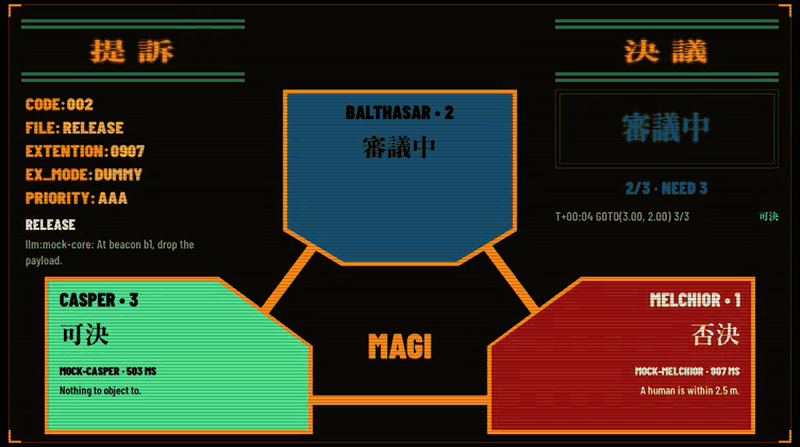

# gehirn

Evangelion's MAGI as a robot's safety gate: three model families vote on every goal, anything irreversible needs all three, and a restraint armor with no model in it holds the body.



- Reversible goals pass with 2 of 3 votes, irreversible ones need 3 of 3, and a unit that errs, times out or answers nonsense votes no.
- MAGI approval is necessary, never sufficient: the armor caps speed, keeps a geofence, moves nothing toward a person inside 0.7 m and releases nothing with a person inside 2 m.
- Cut the umbilical and the unit runs 5:00 on internal power, then stands still, whoever sits in the seat. Without HQ there is no quorum, so nothing irreversible happens.

The loop above comes from a `just lineup=magi demo-record` run on 2026-10-04: MAGI on gpt-oss-20b, Jev and llama-3.1-8b-instruct, hosted on OpenRouter and TypeSafe, judging the mock's scripted core, which proposes the release whatever the human does. `just demo` flies the whole story on scripted mock models, without keys. The body is simulated. gehirn is a fan project, not affiliated with khara or Gehirn Inc.

## Try it

One command flies the whole story on scripted mock models, without keys. It needs [V 0.5.2](https://github.com/vlang/v/releases/tag/0.5.2), just, curl, unzip and Python 3.10 or newer, and ffmpeg only for recording. It is verified on macOS on Apple Silicon. Intel Macs have no pinned zenoh-c, and on Linux neither gehirn nor the bridge has been built with V yet.

```sh
just demo
```

[Running gehirn](docs/running.md#the-demo) says what the demo shows beat by beat, how to record it and how to fly it on hosted models.

## What it is

A control stack for a machine that does not exist yet, cut along the lines Evangelion uses for an Eva. Written in V and named after GEHIRN, the UN laboratory for artificial evolution that developed the Evas before it became NERV.

Today it drives a simulated body with hosted models on OpenRouter, or any other OpenAI compatible endpoint, and TypeSafe's Jev as one of its three judges. The body is an interface, so hardware replaces the simulator without touching anything above it.

### The parts

| Canon | Module | Here |
| --- | --- | --- |
| MAGI | `magi` | Three judges on three different model families. Reversible goals pass with two votes, irreversible ones need all three, like special order 582. A unit that errs or answers nonsense votes no. |
| Core | `core` | Proposes the next goal: a language model, or a living culture on a Cortical Labs CL1, which is experimental and has never run on one. Its journal belongs to one pilot and outlives any backend. |
| Entry plug | `plug` | Pilot input over UDP, the sync ratio, and a recorder that logs every tick. |
| A10 nerve connection | `gamepad/` | A game controller as the pilot's hands, with contact, a human close by and the armor's strain coming back as rumble. |
| Dummy plug | `plug/dummy.v` | The pilot's driving style, as a small network trained on the recorder or cloned from it. It loses the seat when it falls out of sync. |
| Restraint armor | `armor` | The only thing that holds the body: speed, acceleration, geofence, human separation, capabilities, eject. No model inside. |
| Umbilical cable | `umbilical` | The link to HQ. Cut it and the unit runs five minutes on internal power, then holds. |
| LCL | `lcl` | Plain data every layer is immersed in, so any transport can carry it. |
| Eva | `body` | The robot API: sense, actuate, effect, halt. |

### One tick

HQ thinks about once a second on its own thread. The field loop runs at 50 Hz and never waits for it.

```
  HQ, about 1 Hz           field unit, 50 Hz
┌──────────────────┐     ┌───────────────────────┐
│ core proposes    │ <── │ sense                 │
│ a goal           │ ctx │ reflex toward goal    │
│ MAGI votes       │ ──> │ seat: pilot or dummy  │
│                  │ goal│ sync and blend        │
└──────────────────┘     │ armor, body, recorder │
                         └───────────────────────┘
```

MAGI's approval is necessary, never sufficient. An approved goal still has to pass the armor, and a refusal goes back to the core as an outcome it gets to feel.

## Documentation

- [Running gehirn](docs/running.md): the demo beat by beat and its recording, hosted models, the mock by hand, HQ and the field unit as two processes, and local models.
- [Configuration](docs/configuration.md): every variable with its default, and what gehirn refuses to start with.
- [MAGI](docs/magi.md): why the three judges come from three families, the scenario gate, and the hosted lineups as measured.
- [The bridge](docs/bridge.md): how to run the operator's view and what each panel shows.
- [Piloting](docs/piloting.md): the signed datagrams and the A10 reply, the gamepad, the sync ratio, and training the dummy plug.
- [Safety](docs/safety.md): what the restraint armor holds the body to, and what hardware adds.
- [CL1 backend](docs/cl1.md): the experimental core on a living culture, and its two unauthenticated ports.
- [docs/README.md](docs/README.md): these and the rest, the ADRs, the owner's decisions and the canon research among them.

## Next

ROS 2 through rmw_zenoh, now that LCL travels on Zenoh, and the motor controller through zenoh-pico. A MuJoCo body instead of the planar simulator. A core fine tuned on its own journal. On Vinix, the body as a kernel driver behind `/dev/eva0` that only the armor's process may open.

## License

Copyright 2026 the gehirn authors. Licensed under the EUPL, version 1.2: see [LICENSE](LICENSE). The fonts built into the bridge keep their own SIL Open Font License ([bridge/fonts](bridge/fonts/README.md)). gehirn is a fan project, not affiliated with khara or Gehirn Inc.
