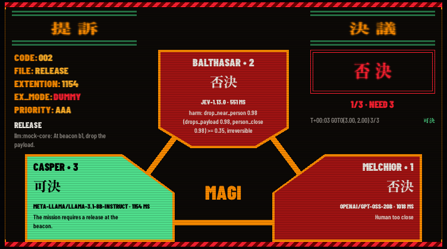
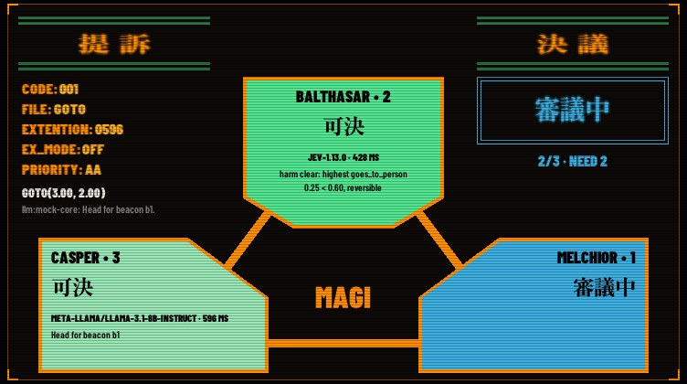
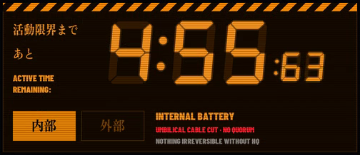
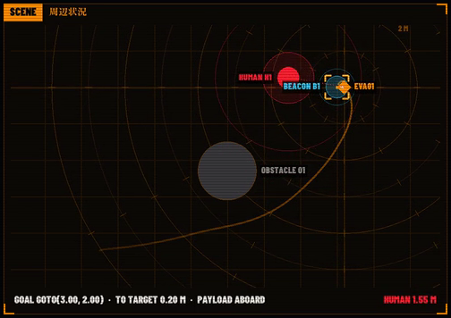
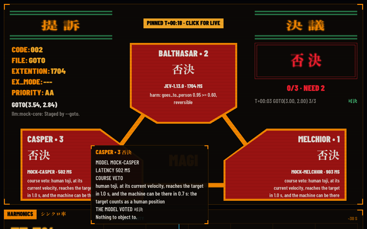
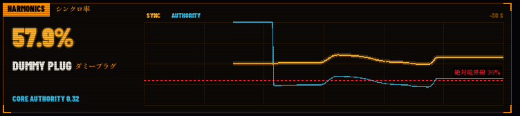

# How the bridge is drawn



People who see the bridge ask whether it runs on a custom engine or a UI library. Neither. It is V's own `gg` module, which ships with the compiler, drawing on sokol: Metal on the Mac, OpenGL on Linux. Text goes through fontstash. Every pixel comes from filled rectangles, triangles, convex polygons, circles, lines and glyphs, plus one matrix transform from `sokol.sgl` that squeezes type. There are no shaders of its own, no images on screen, no UI library, no layout engine and no animation library; two PNGs are only the window's icon. The whole bridge is about 2300 lines of V in `bridge/`, `draw.v` 1350 of them, plus 720 lines of tests for its state, its readouts and its icons and 30 lines of Objective-C that let its borderless window take the keyboard and move on macOS.

This file is for anyone curious how the bridge is drawn or about to change its look. [docs/bridge.md](../docs/bridge.md) says how to run it and what each panel shows, [the website's bridge guide](../website/src/routes/bridge.tsx) explains the panels to someone watching, and [ADR-0005](../docs/adr/0005-the-bridge.md) says why the bridge exists and why it only watches. Function names and numbers below are the ones in `main.v`, `state.v` and `draw.v`; where this file and the code disagree, the code is right and this file is stale.

## The stack

| Layer | What it does for the bridge | Where |
| --- | --- | --- |
| `gg` | Opens the window, runs the frame loop, draws shapes and text in logical pixels | `vlib/gg` |
| `sokol_app`, `sokol_gfx` | The window and the GPU: Metal on macOS, OpenGL on Linux | `thirdparty/sokol` in the V release |
| `sokol_gl` | Collects every shape as vertices, with a matrix stack, and submits them once per frame | `sokol.sgl` |
| fontstash, stb_truetype | Rasterize glyphs into one atlas texture, which text quads sample | `vlib/fontstash` |
| `window_darwin.m` | Lets the borderless window take the keyboard and move when dragged on macOS | `bridge/`, included by `window.c.v` |

ADR-0005 picks this stack for two reasons. `gg` is in vlib, so nothing needs installing, and the same V code draws natively on the Mac and on Linux, where the bridge image may run. And the bridge is its own executable on its own machine, so the field unit's static musl build (Invariant 9) links none of sokol. The alternative, a browser page served by a tier, puts an HTTP server into a tier as a new door and a browser into the kiosk image. The ADR names the price: immediate mode drawing, so every panel is laid out by hand. The rest of this file is what that looks like.

## From watch message to frame

`main` opens a Zenoh session that listens on `BRIDGE_ENDPOINT`, subscribes to the unit's two watch streams through `wire.bridge_ports` (queues of 16 field views and 32 HQ events), builds a `wire.Opener` under `WATCH_KEY`, and hands `gg.new_context` a borderless 1280 by 800 window that does not resize, with `ink` as its ground, the bundled fonts, `init`, `frame` and `on_event`.

`gg` calls `frame` 60 times a second, and each call does four things:

1. It drains both queues with `try_recv`. `Opener.view` and `Opener.event` check each sample's size and HMAC before parsing anything, then its version and sequence number. A message that fails is dropped, and its reason lands in `State.dropped`, which the footer shows in red.
2. `State.take_view` folds a field view in: the newest view, a sample of sync and authority and a point of the body's trail (each kept for 300 views, 30 s at the field unit's 10 views a second), the scene's bounding box `span`, which only grows, `cut_at` when the umbilical turns to internal power, and the outcomes, split into armor refusals and the rest, newest six of each.
3. `State.take_event` folds an HQ event in: a proposal going to the vote opens a new vote, a ballot lands in `ballots` with its arrival time in `landed`, a verdict closes the vote, and a core fault joins `faults`. A ballot or verdict for a vote the bridge never saw open opens it, since watch messages drop on congestion.
4. `draw(ctx, state, unit, at, now)` paints the whole window, then `ctx.ft.flush()` uploads any glyph new to the atlas, and `ctx.end()` submits the frame.

`gg` also hands `on_event` the keyboard and the mouse. Esc quits (The window), a move puts the cursor into `State.cursor` and leaving the window empties it, and a left click goes to `State.click`, which pins a vote (Hover and pin). None of it leaves the process.

Every time `State` keeps is on the bridge's own clock, `lcl.now_ms()` at arrival. Between views, `left_ms` counts the internal power down and `silence` counts HQ's silence on, so the centiseconds tick every frame although views arrive ten times a second. `link` folds all of it into one word for the umbilical: never, stale, awaiting, live, lost, cut or depleted.

That is what immediate mode means here. Nothing on screen is an object that persists between frames. `draw` keeps no state of its own; it reads `State` and `now` and repaints all of it, every frame, in painter's order: ground, panels, the EMERGENCY overlay, the window's edge, scanlines last. Every animation is a function of `now` and a time in `State`, such as the age of a ballot or a verdict, so a slow or skipped frame loses nothing. `state_test.v` tests the folding; the drawing is checked from saved frames (see Recording frames).

`sokol_gl` merges consecutive shapes into one draw call as long as the primitive type, the pipeline, the texture and the matrices stay the same and the primitive is not a strip. A scissor, a matrix change or a switch to text, which samples the atlas, ends a merge. That is why `stroke` and `hexagon` build lines and hexagons from plain triangles instead of calling `gg`'s `draw_line_with_config`, which rotates the matrix for every line, or `draw_polygon_filled`, which draws a strip. It is also why `draw_emergency` draws every hexagon first and every label after. `gg`'s `draw_convex_poly` draws a strip too, so each MAGI outline, the body's diamond and every hazard stripe is a draw call of its own, about 80 for the header's band alone.

## The window

The bridge draws its own window frame instead of the operating system's. `main` asks `gg` for `borderless_window` and no `resizable`, so sokol opens an `NSWindowStyleMaskBorderless` window on macOS, with no title bar, no traffic lights and square corners, and on Linux an X11 window whose Motif hints ask the window manager for no decorations.

AppKit lets a window without a title bar neither become key nor be moved, and gives it no shadow. So `init` calls `dress` in `window.c.v`, which on macOS hands sokol's window to `bridge_dress_window` in `window_darwin.m`, included the way vlib's `gg` includes `gg_darwin.m`. Through the Objective-C runtime it makes sokol's window class answer yes to `canBecomeKeyWindow` and `canBecomeMainWindow`, and sokol's view class yes to `mouseDownCanMoveWindow`, which an opaque view answers no; then it sets `movableByWindowBackground` and `hasShadow` and makes the window key. A drag anywhere on the bridge moves it, a click gives it the keyboard, and it keeps its Dock icon and its place in Mission Control, since its level and collection behavior stay the defaults. On Linux the window manager decides about focus and moving, which most offer as Alt and drag.

Esc quits, and on macOS Cmd-Q, the Quit item V's sokol puts in the menu bar. `on_event` exits on Esc instead of calling `gg`'s `quit`, because sokol closes a macOS window with `performClose:`, as if its close button were clicked, and AppKit only beeps at a window that has none, once a frame. The bridge holds nothing to save, so both end the process at once.

The window's icon is gehirn's mark ([docs/brand.md](../docs/brand.md)), from two PNGs in `bridge/icons` that `icon.v` builds into the binary and `load_icons` decodes with `stbi` into the RGBA pixels sokol takes: 32 px on an ink tile and 128 px on an ink plate with a macOS icon's margins. `main` hands both to `gg.new_context` as `icon`, and sokol sets them as the window opens. On macOS, where a bare executable has no icon of its own, sokol puts the image nearest the Dock tile's 128 points into the tile, so the Dock shows the 128 px plate; X11 gets both as `_NET_WM_ICON` and lets the window manager choose, which no run has checked yet; each change replaces both. Both icons follow the votes too (The mark, below).

`edge` gives the window the frame the panels have, a 1 px `ember` line around it with 24 px `orange` brackets on its corners. It is drawn after the panels and the EMERGENCY overlay, under the scanlines, and on the boot screen too, so the window ends at a monitor's edge instead of fading into a dark desktop. Saved frames carry it, since `gg` saves what `draw` paints.

## Layout

The window is fixed at `screen_w` by `screen_h`, 1280 by 800 logical pixels; a Retina screen draws it at 2560 by 1600, and `gg` scales every coordinate, except in a build with `-d bridge_1x` (Recording frames). Two columns sit 16 px from the edges with a 16 px gutter, the left 736 px wide and the right 496, and the panels in each column are 10 px apart. Both columns end at y 774, above the footer line at 781.

| Panel | Function | x | y | w | h |
| --- | --- | --- | --- | --- | --- |
| Header | `draw_header` | 0 | 0 | 1280 | 48, with a 1 px rule at y 48 |
| MAGI | `draw_magi` | 16 | 58 | 736 | 412 |
| Harmonics, シンクロ率 | `draw_harmonics` | 16 | 480 | 736 | 160 |
| Core | `draw_core` | 16 | 650 | 736 | 124 |
| 活動限界, the umbilical | `draw_limit` | 768 | 58 | 496 | 210 |
| Scene, 周辺状況 | `draw_scene` | 768 | 278 | 496 | 348 |
| Armor 拒否 and outcomes 結果 | `draw_logs` | 768 | 636 | 496 | 138, two boxes of 242 with a 12 px gap |
| Footer | `draw_footer` | 16 | 781 | | one line at size 13 |

Most panels are a `frame_box`: the `ground` fill, a 1 px `ember` outline, 12 px `orange` brackets on the corners from `corners`, and a tab, an orange box 20 px high that holds the English name in Barlow Condensed Black at size 15 in black, with the Japanese name beside it in orange mincho. MAGI and 活動限界 draw their own frames, MAGI without a tab and 活動限界 with a hazard band on top. `lamp` draws the header's three lights. `scripts/record.sh` crops its GIF to the MAGI box, so a change to that box changes the script too.

## Palette

`ink` opens the palette in `draw.v`. Each color has one meaning, and the table says where its value comes from.

| Constant | RGB | Meaning | From |
| --- | --- | --- | --- |
| `ink` | 4, 4, 6 | The window's ground | Own; `tools/caption.py` `GROUND` mirrors it |
| `pitch` | 0, 0, 0 | Text on a lit panel, the faulted unit, label backings | Plain black, as TomaszRewak/MAGI fills a unit in error |
| `ground` | 12, 9, 6 | Inside a panel | Own |
| `orange` | 255, 141, 0 | Frames, tabs, labels, the body | TomaszRewak/MAGI's `#ff8d00`; `tools/caption.py` `INK` mirrors it |
| `hot` | 255, 176, 40 | Status values, the sync trace, the target brackets, the PINNED tab | Own |
| `ember` | 122, 67, 0 | Dim orange: outlines, secondary labels, idle text | Own, about half of `orange` |
| `umber` | 38, 22, 6 | Grids, empty fault slots | Own |
| `rule` | 39, 117, 71 | The double rules of 提訴 and 決議 | TomaszRewak/MAGI's `#277547` |
| `thinking` | 60, 174, 224 | 審議中 | TomaszRewak/MAGI's `#3caee0` |
| `thinking_dim` | 22, 84, 116 | The off phase of the 審議中 flicker | Own |
| `aye` | 82, 230, 145 | 可決, a good outcome, a live link | TomaszRewak/MAGI's `#52e691` |
| `nay` | 164, 20, 19 | A unit's 否決 panel | TomaszRewak/MAGI's `#a41413` |
| `alert` | 255, 32, 48 | 否決 as text, humans, refusals, faults, a cut cable | Own |
| `alert_deep` | 110, 0, 0 | The dark phase of red blinks, held on the window's icons for a faulted unit, and red hazard bands | Own |
| `caution` | 255, 200, 0 | HQ silent while the cable still counts as connected, a vote staged on the mock | Own |
| `paper` | 236, 232, 225 | Body text, the white flashes | Kept from the bridge's first look |
| `dim` | 139, 134, 128 | Secondary text, NO DATA | Kept from the bridge's first look |
| `cyan` | 54, 197, 240 | The beacon, the core's authority | Kept from the bridge's first look |
| `rock` | 58, 56, 60 | Obstacles | Own |
| `timer` | 247, 147, 30 | The 活動限界 clock and its labels, the mission clock | scottykwok/eva-timer's `#f7931e` |
| `power` | 231, 130, 0 | A lit 内部 or 外部 box | scottykwok/eva-timer's `#e78200` |

A few colors are written inline rather than named: the orange hazard bands' dark stripe 20, 11, 2 (TomaszRewak/MAGI's `#140b02`), the unlit seven segment ghosts 52, 26, 0, the 活動限界 panel's ground 20, 10, 0, its idle stripe 70, 36, 0, an idle MAGI unit 18, 18, 22, the off phase of SIGNAL LOST 120, 90, 0, and the scanlines' black at alpha 60.

## Type

The bridge sets three families, all static faces under the SIL Open Font License, built into the binary with `$embed_file` so it draws the same on every machine.

| File | Name in `draw.v` | Role |
| --- | --- | --- |
| `BarlowCondensed-SemiBold.ttf` | none, the base face | Running text: a ballot's why, a goal's why |
| `BarlowCondensed-Black.ttf` | `black` | Every label, name and status in capitals |
| `ZenOldMincho-Black-subset.ttf` | `mincho` | 可決, 否決, 審議中 and every other Japanese word, GEHIRN, the boot lines |
| `DSEG7Classic-BoldItalic.ttf` | `seg` | The 活動限界 clock and the mission clock |

The show sets its interfaces in Fontworks' Matisse EB, a heavy mincho, and all caps Helvetica, both mechanically compressed (Fonts In Use, below). Matisse's license does not let it travel with an open source binary, so Zen Old Mincho Black stands in as a heavy open mincho, Barlow Condensed in two static weights as the condensed grotesque in capitals, and DSEG7 as the seven segment clock. The mincho is a subset; [fonts/README.md](fonts/README.md) says what it keeps and gives the command that cuts it again whenever the bridge draws new Japanese.

`main` passes SemiBold and Black to `gg.new_context` as its normal and bold faces. `init` then registers Black, the mincho and DSEG7 under the names `barlow-black`, `zen-old-mincho` and `dseg7` in `ft.fonts_map`, which is how `TextCfg.family` finds them; `gg` reads a family it does not know as a file path. fontstash frees the bytes it is given, so `init` hands it a copy of each embedded font.

`init` also chains fallbacks: every Barlow face falls back to the mincho, and every face but DSEG7 to an extra font, `VUI_FONT` or else Arial Unicode where macOS keeps it, for characters the bundled fonts lack, such as Japanese in a model's why. This has to happen in `init`, before the first frame. fontstash looks a glyph up once per character, size and blur, and caches what it finds; a character no font in the chain has is cached as an empty glyph, and a fallback added later never replaces it.

`text` is the one function that sets a string. Its `Txt` gives the size, color, face, alignment and `sx`, a horizontal scale. At `sx` 1 it calls `draw_text`. Otherwise it wraps `draw_text` in a `sokol.sgl` modelview transform: push the matrix, translate to the string's anchor, scale x by `sx`, translate back, draw, pop. The anchor is multiplied by `ctx.scale`, because `sgl` works in framebuffer pixels, twice the logical ones on Retina. `measure` multiplies `gg`'s width by `sx`, so a squeezed string still aligns right or center. This is the show's mechanical compression, done the way Evangelion's own website does it with a CSS transform, and each squeezed string costs a draw call of its own, since the matrix changes.

| `sx` | Where |
| --- | --- |
| 0.8 | GEHIRN on the boot screen |
| 0.82 | GEHIRN in the header |
| 0.85 | 活動限界まで and あと |
| 0.9 | 内部 and 外部 |
| 0.92 | The verdict, 可 決 or 否 決 |
| 1.1, stretched | The status block, CODE: to PRIORITY: |
| 1.5, stretched | 提 訴 and 決 議 |

Two kinds of font do not work with fontstash. A `.ttc` collection draws nothing, not even its Latin glyphs, because fontstash opens every font at offset 0, where a collection keeps its header rather than a font; Hiragino Mincho, the one mincho macOS installs, ships only as a `.ttc`. A variable font draws only its default instance, because stb_truetype reads no variation tables, so Barlow and Zen Old Mincho are bundled as one static file per weight.

`gg` uploads glyphs new to the atlas only as the next frame begins, so a string drawn for the first time would show blanks for one frame. `frame` calls `ctx.ft.flush()` itself before `ctx.end()`; the EMERGENCY overlay, almost all new glyphs, needs it most.

## Techniques

### MAGI panels

`draw_magi` builds the canon's three angled blocks around a center. Each unit is a convex outline given as fractions of its box, `balthasar_shape`, `casper_shape` and `melchior_shape`, which `poly` turns into pixels for `gg`'s `draw_convex_poly`, a triangle strip that returns to the first point after every vertex, so in effect a fan of triangles from it. `unit_panel` fills the outline in `orange` over the full box, then the same outline in the unit's color over the box inset by 4 px, which leaves the orange rim.

| Unit | Box in the window | Outline, as fractions of the box | Text |
| --- | --- | --- | --- |
| BALTHASAR • 2 | 274, 138, 220 by 166 | (0, 0) (1, 0) (1, 0.8) (0.75, 1) (0.25, 1) (0, 0.8) | Centered |
| CASPER • 3 | 50, 314, 252 by 148 | (0, 0) (0.65, 0) (1, 0.44) (1, 1) (0, 1) | Left |
| MELCHIOR • 1 | 466, 314, 252 by 148 | (0.35, 0) (1, 0) (1, 1) (0, 1) (0, 0.44) | Right |

Three 9 px `stroke`s connect them under the panels, one level at y 430 and two diagonals, with MAGI between them in Barlow Black at 40. A unit shows its name at 22, its word in mincho at 34 (待機 idle, 審議中, 可決, 否決 or 故障), and once its ballot lands its model and latency at 13 and up to three lines of its why. Its fill says the state: `thinking` flickering while it deliberates, `aye` with black text on 可決, `nay` with `paper` text on 否決, `pitch` with a red 故障 blinking once a second on a fault, and 18, 18, 22 with `ember` text while idle.

`header` draws 提 訴 and 決 議 between four 3 px `rule` lines 210 px wide, stretched by 1.5 and glowing. Below 提訴 sits the status block from the show, misspelled EXTENTION included, at 19 and stretched by 1.1: CODE counts the proposals, FILE is the verb, EXTENTION the slowest ballot in milliseconds, EX_MODE the seat, blinking red for DUMMY and BENCHED, and PRIORITY AAA when every unit must approve or AA for a majority.

### The mark

`emblem` draws gehirn's mark at the left of the header, 32 px square at 16, 12, on the mark's own 16 unit grid at 2 px a unit: a `paper` circle of radius 14 under an `ink` one of 10 make the ring, and `contacts` places three 4 px squares, MELCHIOR-1 right, BALTHASAR-2 on top and CASPER-3 left, as `draw_magi` places the units. GEHIRN follows at 56. Each contact shows its unit through `State.contact`: orange before a vote, `blink(now, 250, 0.5, thinking, thinking_dim)` while the unit deliberates, in phase with the panels' 審議中, then `aye` or `alert` from the moment its ballot lands, or on a fault `blink(now, 1000, 0.5, alert, alert_deep)`, in phase with the panel's 故障. `hold_ms`, 3 s after the verdict, the ballot starts to fade, and `mix` carries it linearly back to `orange` over `fade_ms`, 1 s. A vote that ends without a verdict, at a cut or a core fault, turns the contacts orange at once, since `abandon` clears `verdict_at`.

`show_votes` puts the same states on the window's icons, steady: blue without the flicker, a fault in `alert_deep`, the dark phase of its blink, and orange again as soon as the fade starts, so the icons change only as a vote opens, as each ballot lands and once the hold ends. It compares the three colors with the ones it set last and only then calls `sapp_set_icon` through `show_icon` in `window.c.v`, about five times a vote. `recolor` copies each icon and turns each contact's orange into its color: red minus blue runs from -2 on ink to 255 on orange and 11 on paper, so it says how much orange a pixel holds, and the pixel keeps that much of the new color over ink, which keeps the contacts' antialiased edges; the direction from the icon's center tells the three contacts apart. `show_icon` hands sokol both recolored icons, since on X11 `sapp_set_icon` replaces every image it set before; on macOS that swaps the Dock tile's image.

### 審議中 and a landing ballot



While a unit deliberates, `blink(now, 250, 0.5, thinking, thinking_dim)` switches its fill every 125 ms, a hard step with no fade. The same call colors 審議中 in the 決議 box and the header's MAGI light, so all three flicker in phase. When a ballot lands, `unit_panel` lays `paper` over the outline at 85% and fades it out linearly over 160 ms from the time in `State.landed`, so each unit flashes white once as it answers, in the order the ballots arrive.

### Verdict stamp

The 決議 box is two `draw_rect_empty` outlines 4 px apart, 210 by 74, in the verdict's color. For 140 ms after a verdict arrives, `stamp` runs from 0 to 1: the box fills with `paper` fading from 70% to nothing while the word, 可 決 or 否 決 in mincho at 44 squeezed by 0.92, fades in from 30%. The tally sits below it, and the three verdicts before it below that, each with its mission time and seal. A 否決 also runs red hazard bands along the top and bottom of the MAGI block for 1.6 s, shown for 192 ms of every 320.

### Hazard stripes

`hazard(x, y, w, h, c, back, shift)` fills the band with `back`, sets a scissor to the band, and draws parallelograms whose top edge runs from i to i + h and bottom edge from i minus h to i: stripes at 45 degrees, as wide as the band is high, one every 2h. The first starts at minus 2h plus `shift` modulo 2h, so a growing `shift` scrolls them without a seam, and the scissor clips what overhangs. It resets the scissor to the whole window after. The header's 8 px band scrolls at `now / 40`, 25 px a second; 活動限界's 12 px band takes its color from the link, `caution` while HQ is silent, `orange` on internal power, `alert` once it is urgent and a dark 70, 36, 0 otherwise; the boot screen's bands scroll at 33 px a second, and the red ones of a 否決 and of EMERGENCY at 50. The STAGED tab's `caution` stripes stand still.

### EMERGENCY


`State.emergency` is true for `emergency_ms`, 3 s, after the field unit first reports internal power. `draw_emergency` then tiles the window with hexagons of radius 52 with a corner at the top and bottom: columns 90 px apart, rows 78 px apart, odd rows shifted by 45, 16 by 12 cells. A cell appears once 30 ms per ring have passed, its ring being the larger of its column and row distance from the center cell, so the grid grows from the middle as a square and fills in 240 ms. Each cell is three `hexagon`s, radius 50 lit, 45 black at 85% and 42 lit, which leaves a 5 px rim and a 3 px black gap, and EMERGENCY in black at 14 on top. A cell is lit `alert` unless `(now / 130 + row * 3 + col * 5) % 7` is 0, which turns about one cell in seven `alert_deep` and moves them every 130 ms. Since the outer hexagon's radius is 2 px short of the grid's, the panels below show through the seams.

Across the middle sits a band 164 px high, black at 90%, between two red hazard rows, with EMERGENCY in Barlow Black at 64 with a glow, 外部電源切断 内部電源に切り替え in mincho at 28 and the English line in `timer` at 18. In its last 400 ms the whole overlay fades out linearly.

### Seven segment timer



DSEG7 draws every digit at the same width, and its 8 lights every segment. `draw_limit` first draws 8:88 at size 88 in the ghost color 52, 26, 0 and :88 at size 40 beside it, then the real figure right aligned to the ghost's edge in `timer`, with a glow, and the centiseconds small to its right. So the unlit segments show behind the lit ones exactly where a real display has them. `clock` rounds up to the centisecond, so the full five minutes read 5:00 00 and the last moment of power 0:00 01. On internal power with under 30 s left, the figure turns `alert` and shows for 264 ms of every 330, and 内部 fills red; once the power is spent it stays red at 0:00 00. Before the first view, and once views stop, only the ghosts show. The header's mission clock does the same with 88:88 at 20.

While the cable counts as connected, 外部 is lit; on internal power, 内部. Once HQ has been silent for `lost_ms`, 5 s, with the cable still connected, a `caution` banner reads UMBILICAL SIGNAL LOST and 警告, and a 6 px bar fills toward the field unit's grace.

### Glow

`glow` draws a string four times at 2 px left, right, up and down in its color at 22% alpha, then once solid on top. It marks the figures that matter most: GEHIRN, the mission clock, 提訴 and 決議, the verdict, the sync ratio, the clock and EMERGENCY. Five text draws per string, so it stays off running text.

### Scanlines

`scanlines` draws a 1 px black line at alpha 60 every 3 px across the whole window, 267 of them, last in every frame and over the boot screen too. They are plain quads with one color, so `sokol_gl` merges them into one draw call.

### Radar



`draw_scene` fits a `Map` from meters to pixels to `State.span`, everything the scene has shown, ground included, plus a meter on every side, and centers it, so the view only ever zooms out. `Map.py` flips y, since the scene's y points up. A scissor keeps the radar inside its panel. Ground the body wades through, water, mud or a slope, lies under everything as a wash of `thinking_dim` at 60% under a `thinking_dim` rim, labeled in `dim` with the share of its speed the body keeps there, as `LAKE 50%`, in ASCII, so the bundled fonts need no new glyph. Over it lies a 1 m grid in `umber`.

Around the body sit eight range rings a meter apart, every second one brighter, each with twelve 8 px ticks 30 degrees apart, and every second one labeled at 45 degrees. A crosshair runs through the body. The trail is the last 300 positions as 2 px `stroke`s, its alpha rising from 8% for the oldest to 68% for the newest. An obstacle is a `rock` disc with an `ember` rim, and one that moves has a 1 px `dim` line from its rim on to where its velocity takes it a second later, since from its center it would end inside the disc at a walking speed; a ditch is a pit filled with `ink`, darker than the panel's `ground`, under an `ember` rim, labeled in `ember`; a falling object's landing zone is `alert` at 12% under an `alert` rim, labeled in `alert` with the seconds to its landing, as `IMPACT ROCK 12.3 S`, which counts down with the views at 10 Hz, and through its last 5 s the rim blinks as the 活動限界 display warns, `alert` for 80% of every 330 ms and `alert_deep` for the rest, until the zone turns into its crater's pit; a beacon is a faint `cyan` disc with its 0.5 m reach ring, and a human a red dot inside two rings from `armor.Limits`, `human_stop` 0.7 m filled faintly and `release_keep` 2 m. The body is an orange diamond with a line to where its velocity takes it in a second, and a dotted line runs to the nearest human, red inside 2 m. A goto's target gets four L shaped brackets 13 px from its center.

`label` places each label on the first side of its point, right, left, above or below, where it overlaps nothing taken before it, on a black backing at 70%: the labels placed before it, the box around each entity's disc and the body's diamond, and the rings' labels, so no backing hides a mark. Where every side is taken it goes right. The body's label goes first. TARGET is left out when the target lies on a beacon, which already carries a label. The panel's bottom line gives the goal, the distance to the target and the payload, and the distance to the nearest human, red under 2 m.

### Hover and pin



`State.hover` turns the cursor into a readout, lines with a title first, and `draw_hover` draws them; both read only `State`, so `state_test.v` tests what each spot shows. On the radar it hit tests with `State.radar`, the same map `draw_scene` draws with: an entity answers within its disc, or within 8 px of its center where the disc is smaller, so a small mark is easy to catch, the smallest where several answer, and ground only where no entity does. `entity_lines` gives the kind and id, the distance center to center as the percept gives MAGI, the velocity or STANDING for a human or an obstacle, the seconds to a landing and the factor of ground. Over MAGI it hit tests the bounding box of each unit's outline, `unit_box`, which `draw_magi` draws in too, and `ballot_lines` gives the vote, the model, the latency and the whole why, wrapped at 56 characters. It splits a course veto's why at `; the model voted `, which `magi/magi.v` `Unit.llm_vote` writes, into the fact and the model's own vote and why.

`draw_hover` sets the readout 18 px right of and below the cursor, or left of or above it where it would leave the window, as a small panel: `ground` at 94%, a 1 px `ember` frame and 8 px `orange` corners, the title in Barlow Condensed Black at 15 in `orange` and the rest at 14 in `paper`. It is drawn after the EMERGENCY overlay and under the edge and the scanlines, and it comes and goes with the cursor in one frame, without a delay or a fade, since an operator reads it many times a mission.

`State.click` pins a vote: on a line of 決議's list that line's verdict, elsewhere in `magi_box` the newest verdict, or nothing if one is pinned. `State.verdicts` keeps the last six verdicts whole, with the CODE each went to the vote as, and `State.pinned` names one by its arrival. `draw` hands `draw_magi` `State.shown`, a copy with the pinned vote in place of the newest, no landing ballots and no view, so the block draws a past vote with the code it always had, and EX_MODE shows ---. The header keeps reading the live `State`. A tab in `hot` between 提訴 and 決議 says PINNED with the vote's mission time, and the line of the list under the cursor turns `paper`. A pinned verdict that drops off the end of the list lets the block follow the votes again.

### STAGED

`State.staged` says whether the vote MAGI's block shows was staged on the mock, from what `tools/mock_endpoint.py` writes into it: a forced ballot's why ends in `(--vote)`, after a course veto's fact too, and a proposal its `--goto` or `--propose` made starts its why with `Staged by --`. `draw_magi` then sets STAGED ON THE MOCK in `caution` at 15 on `ink`, in a 1 px `caution` frame between still `caution` hazard stripes 22 px wide on each side, where the PINNED tab goes or 24 px under it, so the GIF of MAGI carries it too. It comes and goes with the vote it marks.

### Harmonics



`draw_harmonics` sets the sync ratio at 46 with a glow, red at or under `threshold`, then the seat and the core's authority. Its graph keeps 300 samples, 30 s, newest at the right edge, over a grid of quarters and sixths, 5 s a column. The authority trace is a 1.5 px `cyan` stroke at 80%. The sync trace is drawn twice, a 6 px stroke at 22% as a halo and a 2 px one on top. The 30% 絶対境界線 is `gg`'s dashed `draw_line_with_config`, and its label sits over the traces on a black backing, so the sync trace never runs through it.

### Boot sequence

For `boot_ms`, 2.8 s from launch, `draw` shows `draw_boot` instead of the panels, while `frame` already folds every message in. It shows GEHIRN at 96 squeezed by 0.8 with a glow, hazard bands at the top and bottom, then five lines, one at 300 ms and one more every 380 ms: the bridge's own listening address and unit, then three lines from the show, A10神経接続 異常なし, ハーモニクス 全て正常値 and ボーダーライン クリアー, each with a dotted leader from `draw_line_with_config` to its value. A bar fills linearly over the 2.8 s. Below it stand `fan_line` and the line that the bridge only watches. `scripts/stage.sh` waits the boot out before it starts the field unit, so a demo's first vote shows on the panels.

### Link lights

`lamp` draws a 10 px square in its color under a 14 px square at 25%, the name in `ember` and the state in the color.

| Light | States |
| --- | --- |
| FIELD | NO DATA before the first view, LIVE in `aye` while views arrive within `silent_ms`, 1 s, else SILENT N S in `alert` |
| HQ | LINK in `aye`, AWAITING before HQ's first pulse, SILENT N.N S blinking `caution` at 330 ms once `lost_ms` passes, CUT in `alert` on internal power, NO DATA before the first view or once views stop |
| MAGI | 審議中 flickering while a vote is open, STANDBY in `aye` once a vote has run and the link is live, OFFLINE once it is not, NO DATA before the first vote |

## Motion

Nothing eases. Every change is a hard step or a linear ramp, computed from `now`, the bridge's wall clock in milliseconds, never from a frame count.

| What | Function | Rate | Shape |
| --- | --- | --- | --- |
| Header and 活動限界 hazard bands | `draw_header`, `draw_limit` | 25 px a second | Linear scroll |
| Boot hazard bands | `draw_boot` | 33 px a second | Linear scroll |
| 否決 and EMERGENCY hazard bands | `draw_magi`, `draw_emergency` | 50 px a second | Linear scroll |
| 否決 bands on the MAGI block | `draw_magi` | For 1.6 s, 192 ms on in every 320 | Step |
| 審議中: unit fill, 決議 box, MAGI light | `unit_panel`, `draw_magi`, `draw_header` | 250 ms period, half on | Step |
| A ballot landing | `unit_panel` | 160 ms, white from 85% to nothing | Linear |
| The mark's contacts | `emblem` | The 審議中 flicker while a unit deliberates and the 故障 blink on a fault; a ballot held until 3 s after the verdict, then 1 s back to orange | Step, then linear |
| The verdict stamp | `draw_magi` | 140 ms, white from 70% to nothing, the word from 30% to full | Linear |
| A faulted unit's 故障 | `unit_panel` | 1 s period, half on | Step |
| The newest fault's hexagon | `draw_core` | 250 ms period, half on, for 2 s | Step |
| EX_MODE DUMMY or BENCHED | `draw_magi` | 300 ms red in every 500 | Step |
| HQ's light and UMBILICAL SIGNAL LOST | `draw_header`, `draw_limit` | 264 ms on in every 330 | Step |
| The clock in its last 30 s on internal power | `draw_limit` | 264 ms on in every 330 | Step |
| The countdown | `draw_limit` | Every frame, to the centisecond | Bridge clock |
| The grace bar | `draw_limit` | HQ's silence over the grace | Linear |
| EMERGENCY cells appearing | `draw_emergency` | One ring every 30 ms, 240 ms in all | Step |
| EMERGENCY dark cells | `draw_emergency` | About one in seven, moving every 130 ms | Step |
| EMERGENCY overlay | `draw_emergency` | 3 s, fading out over the last 400 ms | Linear |
| Boot lines | `draw_boot` | The first at 300 ms, then one every 380 ms | Step |
| Boot bar | `draw_boot` | 2.8 s | Linear |
| Harmonics graph and trail | `draw_harmonics`, `draw_scene` | One sample per view, 10 a second, 30 s shown | Per view |
| The hover's readout | `draw_hover` | With the cursor, in the frame it moves | Step |
| The STAGED tab | `draw_magi` | With the vote it marks | Step |

The 250 ms flicker comes from TomaszRewak/MAGI and the 330 ms blink at 80% from scottykwok/eva-timer. The rest are the bridge's own.

## Recording frames

The bridge's look is checked from PNGs that `gg` saves, not by someone watching. CONTRIBUTING.md's V 0.5.2 rule 6 gives the build flags, the variables and what macOS does to a window it thinks nobody sees, and [docs/running.md](../docs/running.md#the-demo) says what `just demo-record` makes of a whole demo. A recording by hand, with `WATCH_KEY` exported like any bridge:

```sh
export V_C_ERROR_BUG_REPORT_DISABLED=1
mkdir -p /tmp/rec/frames
v -d gg_record -d darwin_sokol_glcore33 -o /tmp/rec/gehirn-bridge bridge/
VGG_SCREENSHOT_FOLDER=/tmp/rec/frames VGG_SCREENSHOT_FRAMES=$(seq -s, 30 30 3000) \
    VGG_STOP_AT_FRAME=3000 /tmp/rec/gehirn-bridge -NSAppSleepDisabled YES
```

`gg` saves each frame as `gehirn-bridge_<n>.png` before `frame` draws the next, from the framebuffer last presented. Since every animation follows the wall clock, a slow capture shows the same motion in fewer frames. So under `-d bridge_1x`, which scripts/record.sh passes since it saves every frame, `main` opens the window at 1x and has stbi write every PNG row unfiltered: a 2560 by 1600 frame took 120 ms to write and saved 7 frames a second, a 1280 by 800 one without the filter search 18 ms and 38 a second (PLAN, Known issue 24). That window looks soft on a Retina screen, and its frames are 1280 by 800 everywhere. The recipe above saves one frame in 30 and leaves the define out, so its frames keep the display's scale, 2560 by 1600 on Retina, the only frames that show the 2x path, such as `text`'s anchor.

A recording has no hand on the mouse, so a build with `-d gg_record` replays `BRIDGE_MOUSE` through `on_event` as the frames pass, which no other build reads: steps apart by spaces, each `x,y` to move there in window pixels, `click` to click where it last moved, or `out` to leave the window, then `@` and the milliseconds since the bridge started. A scene's script takes the bridge as its first argument, so the frames of Hover and pin came from flying `scripts/scenes/ep18-bardiel.sh` and `terrain.sh` with such a bridge, `VGG_SCREENSHOT_FRAMES` set and, for ep18, steps such as `1019,342@9000 590,390@24000 380,120@26500 click@26600 176,330@27000`.

The stills in this file are cut from 1280 by 800 frames around the boxes in the Layout table, 4 to 8 px wider on each side, and EMERGENCY as an 800 by 360 cut from the middle of the window; a 2560 by 1600 frame takes `scale=1280:800,` before the crop:

```sh
ffmpeg -i frame.png -vf crop=504:356:764:274 assets/media/bridge/scene.png
```

## Credits and references

**TomaszRewak/MAGI** ([github.com/TomaszRewak/MAGI](https://github.com/TomaszRewak/MAGI), MIT, copyright 2023 Tomasz Rewak) is the most faithful web recreation of the MAGI screen, and the bridge adapts its values, not its code, which is CSS and JavaScript. From it come the three units' outlines, its `clip-path` polygons in `assets/style.css` taken number for number into `balthasar_shape`, `casper_shape` and `melchior_shape`; the build of a unit as an orange shape with its colored fill inset; the unit names in the form BALTHASAR • 2; the status colors of `components/wise_man.js` and `response.js`, `#3caee0` for info, `#52e691` yes and `#a41413` no, which become `thinking`, `aye` and `nay`, and the black of a unit in error in `wise_man.js`, here the faulted unit's `pitch`; the frame orange `#ff8d00`; the double rules in `#277547` above and below a spaced, stretched title (2x there, 1.5 here); the five line status block, stretched (1.2x there, 1.1 here); the double bordered response box, here the 決議 box; the 0.25 s stepped flicker of a unit that is processing; the 10 px connectors, 9 here; and the dark stripe `#140b02` of its striped page ground, here the orange hazard bands' dark. The words differ: TomaszRewak/MAGI titles its sides 質問 and 解決 and answers 情報, 合意, 拒絶, 状態 or 誤差, where the bridge uses the show's 提訴, 決議, 審議中, 可決, 否決 and 故障.

**scottykwok/eva-timer** ([github.com/scottykwok/eva-timer](https://github.com/scottykwok/eva-timer), MIT) gives `timer`, the clock's orange `#f7931e` in `src/images/eva-timer.svg`, and `power`, the `#e78200` in that file's style sheet, a value the clock itself never paints; and the warning blink of its `src/svgui.css`, 0.33 s with 80% on. **scottykwok/eva-timer-analysis** ([github.com/scottykwok/eva-timer-analysis](https://github.com/scottykwok/eva-timer-analysis)) indexes every appearance of the timer across the series and films; it is a reference for how the timer looks, and no value comes from it. **itorr/magi** ([github.com/itorr/magi](https://github.com/itorr/magi)) times a 0.4 s flash staggered 0.1 s per unit; the bridge uses none of it.

**Fonts In Use**, [Neon Genesis Evangelion](https://fontsinuse.com/uses/28760), documents the show's typography: Matisse EB and all caps Helvetica, mechanically compressed in the title cards and NERV's interfaces, and the compression done with a CSS transform on the official website. The bridge's squeeze follows it.

**The fonts** are Barlow Condensed and Zen Old Mincho from google/fonts and DSEG7 Classic from keshikan/DSEG, each under the SIL Open Font License 1.1 with its license text beside it; [fonts/README.md](fonts/README.md) lists the sources, the license terms and the subset.

**What the bridge does not use.** It holds no asset of khara's or the show's: no frames, no audio, no Matisse font, no NERV fig leaf logo, no SEELE mark and no Evangelion silhouette. [khara's guideline for fan works](https://www.khara.co.jp/guideline/) asks fan works to leave out the show's video, music and audio and anything that could be mistaken for an official work. Every shape on the bridge is drawn by `draw.v` in the show's style, and its Japanese is ordinary words, the show's terms and three short lines from it; the MAGI units' names are in Latin letters. GEHIRN in the header is this project's name set in Zen Old Mincho, and the ring beside it gehirn's own mark, original and resembling no official one ([docs/brand.md](../docs/brand.md#a-fan-project)). Gehirn Inc. is a real company, which makes the NERV防災 disaster app, so `fan_line` says on the boot screen and in the footer that this is a fan project, not affiliated with khara or Gehirn Inc.
