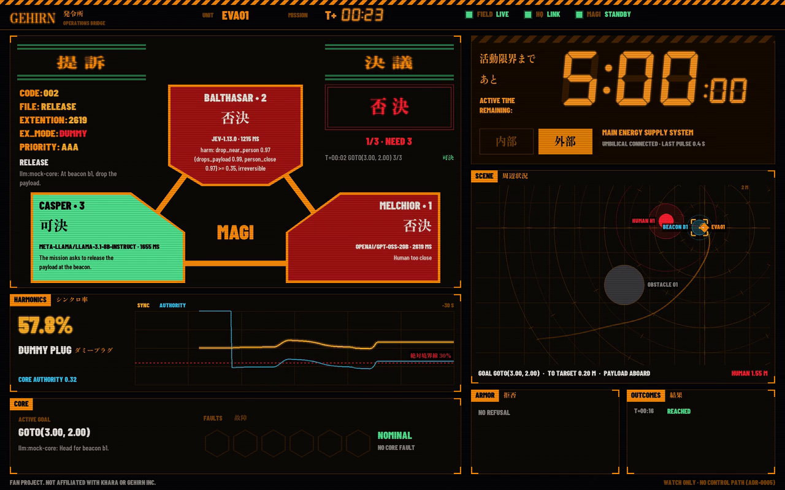

# The bridge



The frame comes from a `just lineup=magi demo-record` run on 2026-10-04: MAGI on gpt-oss-20b, Jev and llama-3.1-8b-instruct, hosted on OpenRouter and TypeSafe, judging the mock's scripted core, which proposes the release whatever the human does.

`./gehirn-bridge` is the operator's view of one unit, drawn in the on screen language of NERV's command center. Everything on it but the boot sequence shows the stack's state.

## Run it

The bridge reads `UNIT_ID`, `WATCH_KEY` and `BRIDGE_ENDPOINT`. Next to a run of [HQ and the field unit apart](running.md#hq-and-the-field-unit-apart), in a second shell with the same `WATCH_KEY` exported:

```sh
just bridge
export WATCH_KEY=<the key the run printed>
./gehirn-bridge
```

Its window is its own: 1280 by 800, without the operating system's title bar or frame, and fixed in size. Drag it anywhere to move it, and quit it with Esc, or Cmd-Q on the Mac; on Linux the window manager moves it, most on Alt and drag. Its icon in the Dock or the task bar is gehirn's mark, whose contacts follow the votes as the header's do.

It boots for under three seconds through its own listening address and three lines from the show, and the boot screen and the footer say it is a fan project, not affiliated with khara or Gehirn Inc. Its fonts are built into the binary ([bridge/fonts](../bridge/fonts/README.md)); `VUI_FONT` names a fallback for glyphs they lack, such as Japanese in a model's why, where macOS's Arial Unicode is missing, as on Linux.

## The panels

- **MAGI** in the canon's three blocks around a center, BALTHASAR•2 above CASPER•3 and MELCHIOR•1. A unit flickers blue with 審議中 while it deliberates and turns 可決, 否決 or 故障 as its ballot lands, with its model, latency and why; 決議 holds the verdict and its tally, or NO VERDICT for a vote that a cut cable or a dropped verdict ended, and 提訴 the proposal with a status block: CODE counts the proposals put to the vote, FILE is the verb, EXTENTION (misspelled as in the show) the slowest ballot in milliseconds, EX_MODE the seat, PILOT, DUMMY, BENCHED or OFF, and PRIORITY AAA when every unit must approve, AA for a majority. A 否決 flashes hazard stripes.
- **活動限界**, the umbilical, in seven segment digits with centiseconds: the whole budget and 外部 while the cable holds, a dim AWAITING HQ until HQ's first pulse reaches the field unit, an amber UMBILICAL SIGNAL LOST with the seconds since HQ's last pulse once HQ has been silent for 5 s, an EMERGENCY overlay for 3 s as the field unit goes to internal power, then 内部 counting down, red and blinking for the last 30 s, and NO FIELD DATA once the field unit's views stop, since only they tell of the cable.
- **シンクロ率**, the harmonics: the sync ratio and the core's authority over the last 30 s against the 30% 絶対境界線, with the seat and a benched dummy plug.
- **The scene** as a radar fitted to everything it has shown: the body's trail and velocity, range rings a meter apart, brackets on a goto's target, each human's 0.7 m and 2 m rings from the armor and the distance to the nearest.
- **The core** with its active goal and a 故障 strip of its faults, **armor refusals** as 拒否, **outcomes**, and a header with gehirn's mark, whose three contacts light up with each unit's ballot ([brand](brand.md#the-live-contacts)), the mission clock and lights for the field unit, HQ and MAGI.

[website/index.html](../website/index.html) explains every panel on an annotated frame, for anyone who watches the bridge rather than runs it, and [bridge/README.md](../bridge/README.md) how it is drawn: V's `gg` on sokol with no UI library, its layout, palette and type, and every technique and rate of motion.

## What it watches

The bridge runs on a machine of its own and only watches ([ADR 0005](adr/0005-the-bridge.md)): it listens on `BRIDGE_ENDPOINT` for the watch streams that `gehirn hq` and `gehirn field` publish under `WATCH_KEY`, declares no publisher, and holds no key that approves or pulses, so closing it changes nothing. A bridge that starts late misses what came before; it shows the newest from then on. Beyond ADR 0005's table, and inside the same two streams, HQ shows each proposal as it goes to MAGI and each ballot as it lands, so the bridge shows the units deliberating and answering one by one, and the field unit's view says whether the dummy plug is benched, whether HQ has pulsed since the field unit started and how long HQ has been silent against `UMBILICAL_GRACE_MS`, so the bridge warns before the cable counts as cut.
